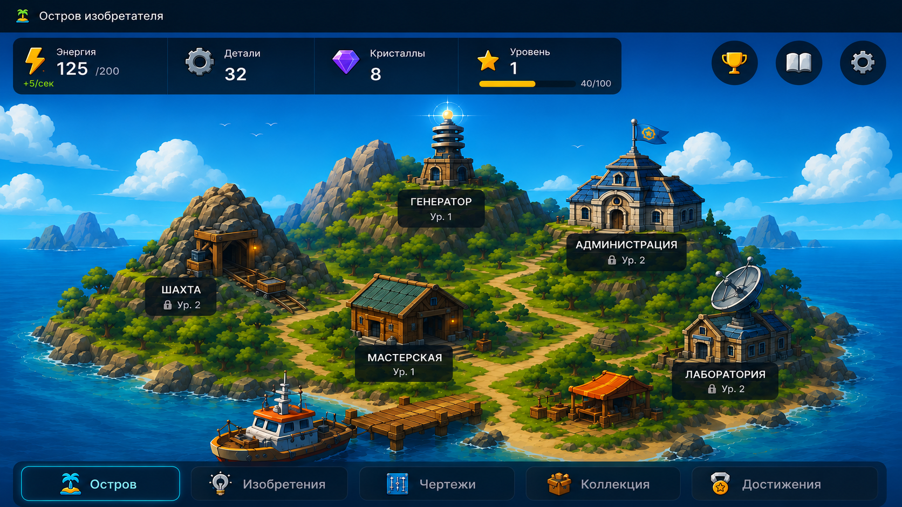

# Остров изобретателя

Мобильный игровой веб-интерфейс с главным островом, экраном администрации,
зданиями, ресурсами и навигацией. Проект рассчитан на использование в
горизонтальной ориентации.

## Просмотр

[Открыть приложение](https://sanecekhorosij-eng.github.io/Test/inventor-island/)



## Возможности

- полноэкранный адаптивный интерфейс;
- поддержка мобильных экранов и безопасных зон устройства;
- интерактивные области зданий и элементов навигации;
- отдельный экран администрации с тремя интерактивными зданиями;
- уведомления при нажатии на кнопки;
- подсказка о повороте устройства в горизонтальное положение;
- режим PWA для запуска с домашнего экрана.

## Технологии

- HTML5;
- CSS3;
- JavaScript без сторонних библиотек;
- Web App Manifest.

## Структура проекта

```text
Test/
├── README.md
└── inventor-island/
    ├── index.html
    ├── administration.html
    ├── manifest.webmanifest
    ├── assets/
    │   └── images/
    │       ├── island-background.png
    │       ├── administration-background.png
    │       ├── game-ui-overlay.png
    │       ├── city-hall.png
    │       ├── control-station.png
    │       └── energy-generator.png
    ├── css/
    │   ├── style.css
    │   └── administration.css
    └── js/
        ├── app.js
        └── administration.js
```

> Имена файлов изображений должны полностью совпадать с указанными выше:
> без пробелов в начале или конце и с тем же регистром букв. GitHub Pages
> различает такие имена, поэтому лишний пробел приводит к ошибке загрузки.

## Локальный запуск

Проект не требует сборки или установки зависимостей.

1. Скачайте или клонируйте репозиторий.
2. Откройте файл `inventor-island/index.html` в браузере.

Для разработки удобнее запустить папку через локальный веб-сервер,
например расширение Live Server в Visual Studio Code.

## Использование на телефоне

1. Откройте ссылку на приложение в браузере.
2. Добавьте страницу на домашний экран.
3. Запустите приложение с созданного значка.
4. Поверните телефон горизонтально.

## Текущее состояние

Это прототип главного экрана и экрана администрации. На экране
администрации стрелка возвращает на главный экран, а активная кнопка
«Остров» остаётся на текущей странице и показывает уведомление. Здания и
остальные элементы навигации реагируют на нажатия. Отдельные игровые
разделы и механики будут добавляться на следующих этапах разработки.
